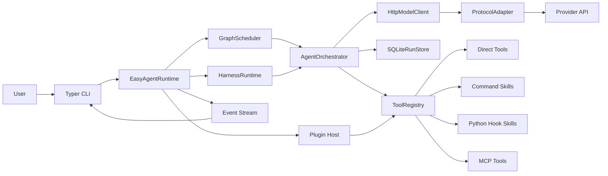
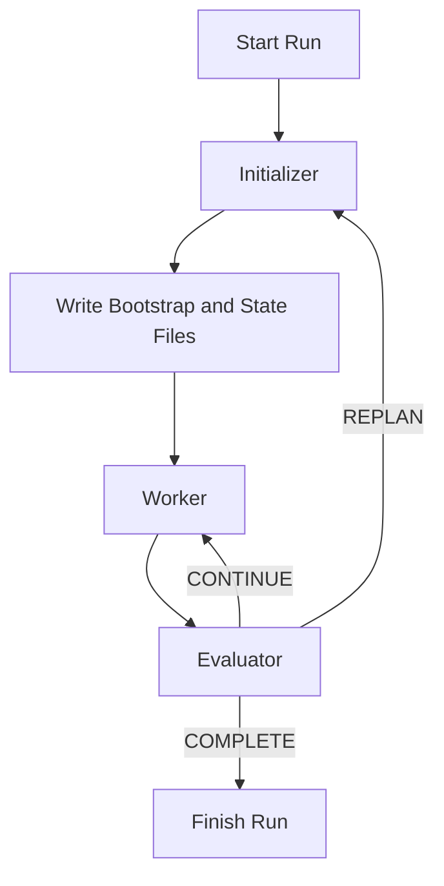

# easy-agent

[English](./README.md) | [简体中文](./README.zh-CN.md)

`easy-agent` is a white-box Python foundation for building agent systems that you can actually inspect, test, and extend.

It is not a business-specific app. It is the runtime layer underneath one. The project gives you a stable place to run single agents, sub-agents, multi-agent graphs, teams, tools, skills, MCP servers, plugins, and now long-running harnesses without hard-coding product logic into the framework.

Current release line: `0.3.x`. The latest published patch is `0.3.3`.

## What This Project Is

Many agent repositories jump straight from "call a model" to "ship a product". That makes the middle messy: tool calling drifts, long tasks become prompt soup, state is hard to resume, and protocol changes leak into business code.

`easy-agent` exists to keep that middle layer explicit.

- It separates runtime engineering from business logic.
- It keeps orchestration visible instead of hiding it behind opaque abstractions.
- It lets you mount new tools, skills, MCP servers, and plugins without rewriting the core.
- It gives long-running work a real harness instead of relying on one giant prompt.

## Who It Is For

- Teams building agent products that need a reusable runtime, not a one-off demo.
- Engineers who want direct control over scheduling, tools, state, and protocol adaptation.
- Projects that need to evolve with provider APIs, tool schemas, MCP, or multi-agent patterns over time.

## What You Get

- A white-box runtime with explicit `scheduler`, `orchestrator`, `registry`, `storage`, and `protocol adapter` layers.
- One runtime for `single_agent`, `sub_agent`, graph workflows, and `Agent Teams`.
- A first-class long-running harness with `initializer -> worker -> evaluator` loops, resumable checkpoints, and durable artifacts.
- A unified model-call surface for `OpenAI`, `Anthropic`, and `Gemini` style payloads.
- A Tool Calling 2.0 runtime that can host direct tools, command skills, Python hook skills, MCP tools, and mounted plugins.
- Built-in session memory, tracing, event streaming, guardrails, human approvals, replay tooling, A2A-style federation, isolated workbench execution, and public evaluation helpers.

## Tech Stack

<table>
  <tr>
    <td valign="top" width="25%">
      <strong>Runtime</strong><br>
      <br>
      <br>
      <br>
      
    </td>
    <td valign="top" width="25%">
      <strong>Model Layer</strong><br>
      <br>
      <br>
      <br>
      
    </td>
    <td valign="top" width="25%">
      <strong>Execution</strong><br>
      <br>
      <br>
      <br>
      
    </td>
    <td valign="top" width="25%">
      <strong>Integration</strong><br>
      <br>
      <br>
      <br>
      
    </td>
  </tr>
</table>

## Features

- Explicit runtime layering so the scheduler, orchestrator, tool registry, storage, and protocol adapters stay inspectable.
- Unified protocol adaptation for `OpenAI`, `Anthropic`, and `Gemini` style model payloads.
- Tool Calling 2.0 support for direct tools, command skills, Python hook skills, MCP tools, and plugin mounting.
- `single_agent`, `sub_agent`, `multi_agent_graph`, and `Agent Teams` collaboration modes.
- Long-running harnesses with durable artifacts, explicit completion contracts, evaluator-driven continue or replan decisions, resumable checkpoints, and approval-aware resume gates.
- Session-oriented memory for direct runs, top-level teams, and harness state reuse.
- Human approval workflows plus safe-point interrupts for sensitive tools, swarm handoffs, harness resumes, and MCP sampling or elicitation requests.
- Guardrail hooks before tool execution and before final output emission.
- Schema-aware tool validation with a repair loop when the model emits invalid arguments.
- Event streaming and tracing across agent, team, tool, guardrail, harness, and MCP boundaries.
- SQLite plus JSONL persistence for runs, traces, checkpoints, session state, harness state, approval requests, interrupts, and resume lineage.
- Historical checkpoint listing, time-travel replay, and branchable `--fork` resume for graph and team workflows.
- A2A-style remote agent federation with exported local targets, remote inspection, task send or stream flows, durable task state, and CLI federation tooling.
- Executor and workbench isolation for long-lived command skills, MCP subprocesses, execution manifests, TTL cleanup, and fork-safe resume snapshots.
- MCP root snapshots with `notifications/roots/list_changed` propagation, root-diff reporting, risk-aware sampling and elicitation approvals, durable URL completion and `accept` / `decline` / `cancel` approval outcomes, `streamable_http`, and authorization-aware remote transports with persisted OAuth state.
- Public evaluation helpers for repo-pinned BFCL v4 cases, cached `official_full_v4` manifest resume paths, SERPAPI-backed web-search cases, tau2 mock cases, checkpointed reruns, and per-provider schema telemetry for OpenAI-compatible schema failures.

## Human Loop, Replay, and MCP

The current runtime already ships the reliability controls that were previously only listed as roadmap work.

- Sensitive tools can pause for human approval before execution, and swarm handoffs plus harness resumes can pause on the same human loop.
- Runs expose safe-point interrupts, approval queues, checkpoint listing, historical replay, and branchable `resume --fork` flows.
- MCP integrations now support explicit roots, backward-compatible filesystem root inference for stdio servers, durable root snapshots, root-diff refresh output, `notifications/roots/list_changed` propagation when the server surface supports it, risk-aware sampling callbacks, richer form or URL elicitation callbacks, `streamable_http`, and auth-aware remote transports with persisted OAuth state.
- High-risk MCP sampling and URL elicitation requests are forced into deferred approval instead of silently bypassing the human loop, and URL-mode elicitation completion plus explicit `accept` / `decline` / `cancel` outcomes now stay in the same durable approval record. The CLI exposes `approvals`, `checkpoints`, `replay`, `interrupt`, `mcp roots`, and `mcp auth` commands so these controls stay usable without custom code.

## A2A Remote Agent Federation

`easy-agent` now ships a more durable A2A-style federation layer instead of a polling-only bridge.

- `federation.server` can publish local agents, teams, or harnesses as exported targets.
- `federation.remotes` can inspect remote cards and prefer SSE push or fall back to polling with `push_preference = auto|sse|poll`.
- Federated delivery now includes well-known discovery, persisted task event logs, SSE event streaming, webhook push delivery, retry with backoff, lease renewal, cancellation, `pushNotificationConfig` set/get/list/delete compatibility, and reconnect-safe `sendSubscribe` or resubscribe flows.
- `agent-card` and `extended-agent-card` now expose camelCase-first `defaultInputModes` / `defaultOutputModes`, richer artifact or part metadata, `notificationCompatibility`, pagination hints, and `securitySchemes` plus `security` requirements alongside the easy-agent compatibility fields.
- Federation auth now supports first-class OAuth/OIDC token acquisition and refresh for both `client_credentials` and `authorization_code` flows, with durable token state reused by runtime and CLI surfaces.
- Signed cards and signed callback payloads can now be verified through JWKS/JWS metadata, and federated task or subscription access is constrained by stricter tenant/task authorization boundaries before state is revealed or mutated.
- Remote inspection stays available even when a remote requires auth that this client is not configured to satisfy, while actionable calls now fail fast with card-driven readiness checks for bearer, header, OAuth/OIDC, callback audience or signature expectations, and optional client-side mTLS handshakes.
- Federated task and event listing now support cursor pagination through `pageToken` / `nextPageToken`, and the CLI accepts `--page-token` / `--page-size` for `easy-agent federation tasks` and `easy-agent federation events`.
- Federated task state plus subscription state is persisted in SQLite so remote execution, backlog replay, and push delivery can be inspected after the initial request completes.
- The CLI now exposes `easy-agent federation list|inspect|tasks|events|cancel-task|subscriptions|renew-subscription|cancel-subscription|push-set|push-get|push-list|push-delete|send-subscribe|resubscribe|serve`.
- Federation auth CLI helpers now expose `easy-agent federation auth status|login|refresh|logout` for remote token inspection and lifecycle control.

Example shape:

```yaml
federation:
  server:
    enabled: true
    host: <LOCAL_HOST>
    port: 8787
    base_path: /a2a
    public_url: https://agent.example.com/a2a
    protocol_version: "0.3"
    card_schema_version: "1.0"
    retry_max_attempts: 4
    retry_initial_backoff_seconds: 0.5
    security_schemes:
      - name: oidc_main
        type: oidc
        openid_config_url: https://login.example.com/.well-known/openid-configuration
        audience: https://agent.example.com/a2a
    security_requirements:
      - oidc_main: []
    push_security:
      callback_url_policy: public_only
      signature_secret_env: FEDERATION_CALLBACK_SECRET
      require_signature: true
      audience: repo-delivery-callback
      require_audience: true
  exports:
    - name: repo_delivery
      target_type: harness
      target: delivery_loop
      modalities: [text]
      capabilities: [streaming, interrupts]
  remotes:
    - name: partner
      base_url: https://partner.example.com/a2a
      push_preference: auto
      auth:
        type: oidc
        token_env: PARTNER_AGENT_TOKEN
        oauth:
          audience: https://partner.example.com/a2a
          openid_config_url: https://login.partner.example.com/.well-known/openid-configuration
```

## Executor / Workbench Isolation

The runtime now has a dedicated executor or workbench layer for long-lived code execution, tool runs, and environment tasks.

- `WorkbenchManager` provisions per-run isolated roots under `.easy-agent/workbench` and persists backend runtime state alongside each session.
- `executors` now support `process`, `container`, and `microvm` backends behind the same workbench interface.
- The `container` backend can now preload offline archives, auto-build from a bootstrap context, enforce `memory` or `cpu` quotas, and restore from a committed snapshot image for repeatable host validation.
- The `microvm` backend now supports both classic `qemu` and a `podman_machine` SSH-backed provider so the same isolation surface can be exercised on hosts that already have Podman machine assets.
- Command skills and stdio MCP servers can opt into a named executor through `skill.metadata.executor` or `mcp[*].executor` and then reuse the same long-lived session.
- Graph and harness checkpoints capture workbench manifests, and forked resume clones those manifests into new session roots without discarding the original lineage.
- SQLite persists `workbench_sessions`, `workbench_executions`, runtime-state payloads, federated task state, and executor reuse metadata for later inspection.
- The real-network suite now exercises process reuse, offline container restore, and podman-machine microVM recovery as real host coverage instead of leaving those rows as `skipped`.
- The CLI now exposes `easy-agent workbench list` and `easy-agent workbench gc`.

## Architecture

The runtime is intentionally white-box. The important layers are visible and replaceable.

- `scheduler` runs direct-agent and graph workflows.
- `harness` runs long tasks through explicit initializer, worker, and evaluator phases.
- `orchestrator` executes agent and team turns.
- `registry` exposes direct tools, skills, MCP tools, and mounted plugin tools.
- `storage` persists runs, traces, checkpoints, session state, and harness state.
- `protocol adapters` normalize provider-specific request and response shapes.

### Runtime Topology



## Long-Running Harness Design

Long-running work should not depend on a single giant prompt. In this repository, a harness is a first-class runtime capability.

Each harness defines:

- an `initializer_agent`
- a `worker_target` that can be an agent or a team
- an `evaluator_agent`
- an explicit `completion_contract`
- durable artifact paths
- bounded `max_cycles` and `max_replans`

The harness writes three durable files per session:

- `bootstrap.md`: human-readable kickoff and recovery instructions
- `progress.md`: cycle-by-cycle progress log
- `features.json`: machine-readable state, decisions, and counters

### Harness Loop



The harness design is informed by Anthropic's article [Effective harnesses for long-running agents](https://www.anthropic.com/engineering/effective-harnesses-for-long-running-agents) published on November 26, 2025. The key idea is simple: long tasks need explicit coordination code, clear completion checks, and recoverable artifacts, not just a stronger model.

## Protocol and Tool Model

### Model Protocols

- `OpenAI` style payloads, including OpenAI-compatible providers such as DeepSeek.
- `Anthropic` style payloads.
- `Gemini` style payloads.

### Tool Calling 2.0 Runtime

The runtime can expose tools from multiple sources through one registry:

- direct in-process tools
- command skills
- Python hook skills
- MCP tools over `stdio`, `HTTP/SSE`, or `streamable_http`
- mounted plugins from local paths, manifests, or entry points

## Project Layout

```text
src/
  agent_cli/           CLI entrypoints and commands
  agent_common/        shared models and tool abstractions
  agent_config/        typed config models and validation
  agent_graph/         orchestration, graph scheduling, team runtime
  agent_integrations/  skills, MCP, plugins, sandbox, storage, guardrails, federation, workbench
  agent_protocols/     protocol adapters and model client
  agent_runtime/       runtime assembly, harnesses, benchmarks, long-run flows, public eval
skills/
  examples/            local demo skills
  real/                real validation skills
configs/
  harness.example.yml  long-running harness example
  longrun.example.yml  real MCP + skill validation
  teams.example.yml    Agent Teams examples
tests/
  unit/                fast isolated tests
  integration/         live-service integration tests
```

## Quick Start

### Environment

```powershell
uv venv --python 3.12
uv sync --dev
```

### Local Credentials

The runtime auto-loads a local-only `.env.local` file. This keeps machine-specific secrets out of tracked files while avoiding repeated manual exports.

Example:

```dotenv
DEEPSEEK_API_KEY=your-key
PG_HOST=<LOCAL_HOST>
PG_PORT=5432
PG_USER=postgres
PG_PASSWORD=your-password
PG_DATABASE=postgres
REDIS_URL=redis://<LOCAL_HOST>:6379/0
```

### Common Commands

```powershell
uv run easy-agent doctor -c easy-agent.yml
uv run easy-agent skills list -c easy-agent.yml
uv run easy-agent plugins list -c easy-agent.yml
uv run easy-agent teams list -c configs/teams.example.yml
uv run easy-agent harness list -c configs/harness.example.yml
uv run easy-agent federation list -c easy-agent.yml
uv run easy-agent workbench list -c easy-agent.yml
uv run easy-agent run "summarize the repository" --session-id demo-session --approval-mode deferred -c easy-agent.yml
uv run easy-agent approvals list --status pending -c easy-agent.yml
uv run easy-agent approvals cancel <request_id> -c easy-agent.yml
uv run easy-agent checkpoints <run_id> -c configs/teams.example.yml
uv run easy-agent replay <run_id> --checkpoint-id <checkpoint_id> -c configs/teams.example.yml
uv run easy-agent resume <run_id> --checkpoint-id <checkpoint_id> --fork -c configs/teams.example.yml
uv run easy-agent interrupt <run_id> --reason "human stop" -c configs/teams.example.yml
uv run easy-agent harness run delivery_loop "Create a release summary for this repository" -c configs/harness.example.yml --session-id demo-harness --approval-mode deferred
uv run easy-agent harness resume <run_id> -c configs/harness.example.yml --approval-mode deferred
uv run easy-agent mcp roots list filesystem -c configs/longrun.example.yml
uv run easy-agent mcp roots refresh filesystem -c configs/longrun.example.yml
uv run easy-agent mcp auth status filesystem -c configs/longrun.example.yml
```

### Local GitHub Automation Skill Pack

The default `easy-agent.yml` now reserves an optional local-only skill root at `.easy-agent/local-skills/github_automation`.

- When that local skill pack exists, the coordinator starts with `github_issue_list`, `github_issue_prepare_fix`, `git_commit_local`, and `github_release_publish` ahead of the generic demo tools.
- The pack is intentionally untracked so repo-specific delivery automation can stay private to one checkout.
- `github_issue_prepare_fix` prepares a branch plus a task package under `.easy-agent/github-automation/issues/<number>/` instead of silently editing code.
- Install GitHub CLI first and authenticate it locally before using those skills: `gh --version` and `gh auth login`.

### Python Runtime Example

```python
from pathlib import Path

from agent_runtime.runtime import build_runtime

runtime = build_runtime('configs/harness.example.yml')
runtime.load(Path('skills/examples'))
runtime.load('third_party_plugin')
```

## What a Harness Run Produces

A successful harness run does more than return text.

- It persists run metadata and checkpoints in SQLite.
- It streams runtime events for CLI or observer consumption.
- It writes `bootstrap.md`, `progress.md`, and `features.json` so a later run can resume from explicit state.
- It can reuse prior harness state when you pass the same `--session-id`.

## Verification

The repository currently uses these verification paths on this machine:

```powershell
.\.venv\Scripts\python.exe -m ruff check src tests scripts
.\.venv\Scripts\python.exe -m mypy src tests scripts
.\.venv\Scripts\python.exe -m pytest tests/unit -q --basetemp=%TEMP%\easy-agent-pytest\unit-full-<timestamp>
.\.venv\Scripts\python.exe -m pytest tests/integration -m real -q --basetemp=%TEMP%\easy-agent-pytest\integration-full-<timestamp>
.\.venv\Scripts\python.exe scripts\benchmark_modes.py --config easy-agent.yml --repeat 1 --output .easy-agent\benchmark-report.json
.\.venv\Scripts\python.exe -  # helper script calling run_public_eval_suite('easy-agent.yml')
.\.venv\Scripts\python.exe -m pytest tests/integration/test_real_network_eval.py -m real -q --basetemp=%TEMP%\easy-agent-pytest\integration-real-network-<timestamp>
```

Python CLI smoke is also verified through `CliRunner` against `agent_cli.app:app` for `--help`, `doctor`, `teams list`, `harness list`, and `federation list`.

### Docs-Mapped Similar Project Comparison

This is a documentation-mapped capability comparison against official project docs, not an apples-to-apples benchmark or leaderboard.

| Project | Basis | Sessions / State | Teams / Handoffs | Resume / Replay | Isolation | Eval Surface |
| --- | --- | --- | --- | --- | --- | --- |
| `easy-agent` | repo-local tested evidence | `session_id`, `session_messages`, `session_state`, `harness_state` | agent teams, graph handoff, harness worker routing | resume, replay, fork, checkpoints | process / container / microVM workbench executors | repo-pinned BFCL, `official_full_v4` resume path, tau2, real-network telemetry |
| `OpenAI Agents SDK` | official docs mapping | sessions documented | handoffs documented | not positioned as graph replay or time-travel runtime | not a first-class executor matrix in docs | official function-calling and structured-output surface, but no BFCL-style built-in eval matrix in docs |
| `AutoGen` | official docs mapping | memory and state patterns documented | teams documented | stateful workflows documented, less replay-centric than `easy-agent` | code execution documented | no repo-local BFCL or real-network matrix in docs |
| `LangGraph` | official docs mapping | state persistence documented | graph routing documented | durable execution and time-travel documented | not a built-in container / microVM executor matrix in docs | no built-in BFCL or real-network matrix in docs |

## Real Network Test Set Results

Snapshot date: April 10, 2026.

This snapshot combines a fresh full Python verification pass from April 10, 2026. The real-network artifact was refreshed in this round, while the benchmark and public-eval artifacts below are retained April 9, 2026 snapshots. The retained public-eval artifact still targets the repo-pinned `full_v4` profile; the shipped `official_full_v4` manifest cache and checkpoint path are implemented, but that broader manifest was not the live artifact refreshed in this verification pass.

### Python Verification Snapshot

| Suite | Command | Result |
| --- | --- | --- |
| Static checks | `.\.venv\Scripts\python.exe -m ruff check src tests scripts` | passed |
| Typing | `.\.venv\Scripts\python.exe -m mypy src tests scripts` | passed |
| Full unit suite | `.\.venv\Scripts\python.exe -m pytest tests/unit -q --basetemp=%TEMP%\easy-agent-pytest\unit-full-<timestamp>` | `140 passed` |
| Focused real-network pytest | `.\.venv\Scripts\python.exe -m pytest tests/integration/test_real_network_eval.py -m real -q --basetemp=%TEMP%\easy-agent-pytest\integration-real-network-<timestamp>` | `1 passed` |
| Full real integration suite | `.\.venv\Scripts\python.exe -m pytest tests/integration -m real -q --basetemp=%TEMP%\easy-agent-pytest\integration-full-<timestamp>` | `5 passed`, with 5 known Windows cleanup warnings |
| Live real-network artifact | `.easy-agent/real-network-report.json` | refreshed on April 10, 2026 |
| Retained public-eval artifact | `.easy-agent/public-eval-report.json` | retained April 9, 2026 snapshot |
| Retained benchmark artifact | `.easy-agent/benchmark-report.json` | retained April 9, 2026 snapshot |

This verification pass reran the full real integration suite and refreshed `.easy-agent/real-network-report.json`; the benchmark and public-eval snapshots shown below are retained from the previous April 9, 2026 refresh. BFCL web-search evaluation now routes through the SERPAPI configuration surface in `easy-agent.yml`, while the runtime still preserves replay fallback behavior when credentials are missing, quotas are exhausted, or a compatible backend becomes temporarily unavailable.

### Real Network Matrix

| Scenario | Transport | Status | Duration (s) | Notes |
| --- | --- | --- | --- | --- |
| `cross_process_federation` | `http_poll` | passed | `1.2584` | cross-process well-known discovery and send/poll federation passed |
| `live_model_federation_roundtrip` | `http_poll` | passed | `38.0432` | live-model loopback federation completed through the local A2A surface after API-key, TCP, and HTTP preflight checks |
| `disconnect_retry_chaos` | `http_webhook` | passed | `5.0479` | callback retry, `pushNotificationConfig`, `sendSubscribe`, signed webhook delivery, and resubscribe passed |
| `duplicate_delivery_replay_resilience` | `http_webhook` | passed | `3.9962` | duplicate delivery, signed callback replay, and stable federated task event logs passed |
| `workbench_reuse_process` | `local_process` | passed | `1.8405` | process workbench reused the same long-lived session root |
| `workbench_reuse_container` | `podman_exec` | passed | `31.3088` | container executor loaded an offline image archive, enforced quotas, and resumed from a snapshot image |
| `workbench_incremental_snapshot_reuse_container` | `podman_exec` | passed | `51.0611` | container repeated checkpoint restore preserved incremental state across restart cycles |
| `workbench_reuse_microvm` | `podman_machine_ssh` | passed | `19.7863` | microVM executor reused the podman machine over SSH and recovered after a disconnect-style restart |
| `workbench_incremental_snapshot_reuse_microvm` | `podman_machine_ssh` | passed | `28.5456` | microVM repeated checkpoint restore preserved incremental state across restart cycles |
| `replay_resume_failure_injection` | `sqlite_checkpoint` | passed | `6.5586` | resume, replay, and fork recovery passed under injected failure |

Summary: `10 passed`, `0 failed`, `0 skipped`.
Source: `.easy-agent/real-network-report.json` generated at `2026-04-10T00:08:24Z`.

### Warm-Start Telemetry Snapshot

| Metric | Value | Notes |
| --- | --- | --- |
| Telemetry-bearing scenarios | `4` | container and microVM warm-start or snapshot-restore rows emit telemetry |
| Cache hit rate | `1.0000` | all four warm-start rows hit a reusable warm cache |
| Warm-start budget status | `within_budget=4` | latency budgets were met for all four warm-start rows |
| Container warm-start average | `5.6515s` | average across container warm-start and incremental snapshot reuse |
| microVM warm-start average | `8.3451s` | average across microVM warm-start and incremental snapshot reuse |
| Snapshot drift ratio average | `0.4222` | average absolute drift versus cold-start baseline |
| Snapshot drift ratio max | `0.6873` | current worst-case container restart drift |

### Live Benchmark Snapshot

| Mode | Success | Average Duration (s) |
| --- | --- | --- |
| `single_agent` | yes | `4.2843` |
| `sub_agent` | yes | `20.7399` |
| `multi_agent_graph` | yes | `9.8910` |
| `team_round_robin` | yes | `7.7402` |
| `team_selector` | yes | `9.7480` |
| `team_swarm` | yes | `8.2819` |

Source: `.easy-agent/benchmark-report.json` retained from the April 9, 2026 snapshot.

### Public Eval Snapshot

| Suite | Pass Rate | Notes |
| --- | --- | --- |
| `bfcl_simple` | `1.0000` | 8 of 8 cases passed |
| `bfcl_multiple` | `0.8750` | 7 of 8 cases passed |
| `bfcl_parallel_multiple` | `1.0000` | 4 of 4 cases passed |
| `bfcl_irrelevance` | `1.0000` | 4 of 4 cases passed |
| `bfcl_format_sensitivity` | `1.0000` | 3 of 3 cases passed |
| `bfcl_memory` | `0.0000` | 0 of 3 cases passed; current misses are memory-key semantics and replay grounding |
| `bfcl_web_search` | `0.0000` | 0 of 3 cases passed; current misses are duplicate-call and query-shaping drift |
| `tau2_mock` | `1.0000` | 3 of 3 cases passed |
| `overall.bfcl_pass_rate` | `0.7879` | current blockers have shifted to memory and web-search rather than strict-schema transport failures |

Current artifact scope: `profile=full_v4`, `scope=repo_pinned`, `completed_records=36`, `resume_enabled=false`. The runtime now also ships a cached `official_full_v4` manifest path with checkpoint resume, but that broader manifest was not part of the retained snapshot shown in this pass.

### Stage-Aware Public Eval Analytics

| Metric | Value | Notes |
| --- | --- | --- |
| Base-stage terminal pass rate | `0.8056` | 29 of 36 records completed successfully without leaving the base stage |
| Retry-stage transitions | `0` | no extra fallback stages fired in the retained repo-pinned snapshot |
| Failure buckets | `memory_backend_miss=3`, `duplicate_call=2`, `other=2` | current misses are behavior or grounding issues, not provider-side schema transport failures |

### Provider Schema Compatibility Matrix

| Provider | Protocol | Compatibility Summary | Notes |
| --- | --- | --- | --- |
| `openai_compatible` | `openai` | strict path observed | live capability telemetry reports `strict_flag`, nullable preservation, optional-to-required nullable promotion, and `parallel_tool_calls` control; unit regression still covers recursive `additionalProperties: false` on the strict path |
| `anthropic` | `anthropic` | provider-native passthrough | current adapter intentionally preserves the original schema shape instead of coercing it into the OpenAI-compatible subset |
| `gemini` | `gemini` | normalized and pruned | keeps the OpenAI-like normalization path for broad schema cleanup, but does not currently expose OpenAI-only strict or parallel-call controls |

Source: `.easy-agent/public-eval-report.json` retained from the April 9, 2026 snapshot.

Current caveats:

- The full real integration suite still emits Windows asyncio subprocess cleanup warnings after success; on this machine they remain cleanup debt rather than functional failures and accounted for 5 warnings in the latest April 10 pass.
- The retained public-eval snapshot is still weakest in `bfcl_memory` and `bfcl_web_search`; the web-search misses include duplicate-call, query-shaping, and result-grounding errors, while the memory misses are key-shape or grounding issues.
- The retained benchmark snapshot is fully green, but the `sub_agent` path is still materially slower than the other benchmark modes because it pays for both a live coordinator turn and a live delegated turn.

## Next Reinforcement

These next steps are based on the current public A2A, MCP, and OpenAI tool-calling surfaces, not just internal backlog notes.

- Close the current BFCL memory misses by aligning memory-tool key conventions, replaying cross-turn state more faithfully, and adding regression cases that distinguish memory-backend misses from plain argument mismatch.
- Reduce BFCL web-search misses by tightening single-call behavior, query shaping, and result grounding for the SERPAPI-backed `/search.json` flow and replay-backed contents retrieval, while preserving the quota ledger and replay fallback path.
- Expand the shipped `official_full_v4` manifest acquisition and cache-resume path into a repeatable verification flow so repo-pinned and official-manifest snapshots can be compared over time.
- Continue provider compatibility hardening around the official OpenAI function-calling and structured-output constraints with deeper regression coverage for `strict: true`, recursive `additionalProperties: false`, nullable-vs-optional modeling, and single-call versus parallel-call enforcement.
- Carry OpenAI structured-output refusal, incomplete, and schema-unsupported states into durable runtime events and public-eval telemetry so provider incompatibility can be separated cleanly from model refusal or truncation behavior.
- Extend real-network telemetry from the latest warm-start budgets into trendable history so cache-hit rate, recovery speed, and snapshot drift can be compared across runs instead of living only in the latest report.
- Continue aligning federation with the latest public A2A surface around richer agent-card metadata, signed-card rotation telemetry, OAuth/OIDC discovery caching, push-notification authentication details, task history filters, and status-timestamp fidelity.
- Keep hardening federated trust boundaries with stricter tenant/task scope regression coverage, callback JWKS rotation handling, and clearer auth-readiness diagnostics before remote task creation.
- Continue MCP parity against the newer public server-feature surface with `notifications/prompts/list_changed`, `notifications/resources/list_changed`, `notifications/tools/list_changed`, `resources/subscribe`, and reconnect-safe notification replay across transport resumes.

## Design References

- Anthropic, [Effective harnesses for long-running agents](https://www.anthropic.com/engineering/effective-harnesses-for-long-running-agents)
- OpenAI Agents SDK Sessions: [https://openai.github.io/openai-agents-python/sessions/](https://openai.github.io/openai-agents-python/sessions/)
- OpenAI Agents SDK Handoffs: [https://openai.github.io/openai-agents-python/handoffs/](https://openai.github.io/openai-agents-python/handoffs/)
- OpenAI Agents SDK Guardrails: [https://openai.github.io/openai-agents-python/guardrails/](https://openai.github.io/openai-agents-python/guardrails/)
- OpenAI Agents SDK Tracing: [https://openai.github.io/openai-agents-python/tracing/](https://openai.github.io/openai-agents-python/tracing/)
- OpenAI Function Calling: [https://platform.openai.com/docs/guides/function-calling](https://platform.openai.com/docs/guides/function-calling)
- OpenAI Structured Outputs: [https://platform.openai.com/docs/guides/structured-outputs](https://platform.openai.com/docs/guides/structured-outputs)
- SerpApi Google Search API: [https://serpapi.com/search-api](https://serpapi.com/search-api)
- AutoGen Teams: [https://microsoft.github.io/autogen/stable/user-guide/agentchat-user-guide/tutorial/teams.html](https://microsoft.github.io/autogen/stable/user-guide/agentchat-user-guide/tutorial/teams.html)
- LangGraph Durable Execution: [https://docs.langchain.com/oss/python/langgraph/durable-execution](https://docs.langchain.com/oss/python/langgraph/durable-execution)
- Google Developers Blog, [Announcing the Agent2Agent Protocol (A2A)](https://developers.googleblog.com/es/a2a-a-new-era-of-agent-interoperability/)
- A2A Protocol: [https://a2aprotocol.ai/](https://a2aprotocol.ai/)
- A2A Latest Specification: [https://a2a-protocol.org/latest/specification/](https://a2a-protocol.org/latest/specification/)
- A2A Reference Implementation: [https://github.com/a2aproject/A2A](https://github.com/a2aproject/A2A)
- OpenID Connect Discovery 1.0: [https://openid.net/specs/openid-connect-discovery-1_0-final.html](https://openid.net/specs/openid-connect-discovery-1_0-final.html)
- RFC 7515 JSON Web Signature (JWS): [https://www.rfc-editor.org/rfc/rfc7515](https://www.rfc-editor.org/rfc/rfc7515)
- RFC 7517 JSON Web Key (JWK): [https://datatracker.ietf.org/doc/html/rfc7517](https://datatracker.ietf.org/doc/html/rfc7517)
- MCP Roots: [https://modelcontextprotocol.io/docs/concepts/roots](https://modelcontextprotocol.io/docs/concepts/roots)
- MCP Sampling: [https://modelcontextprotocol.io/docs/concepts/sampling](https://modelcontextprotocol.io/docs/concepts/sampling)
- MCP Elicitation: [https://modelcontextprotocol.io/docs/concepts/elicitation](https://modelcontextprotocol.io/docs/concepts/elicitation)
- MCP Transports: [https://modelcontextprotocol.io/docs/concepts/transports](https://modelcontextprotocol.io/docs/concepts/transports)

## Acknowledgements

- [Linux.do](https://linux.do/) for community discussion and open knowledge sharing.
- [](https://www.deepseek.com/) for the live verification baseline and model endpoint.

## License

[Apache-2.0](https://github.com/CloudWide851/easy-agent?tab=Apache-2.0-1-ov-file#)

