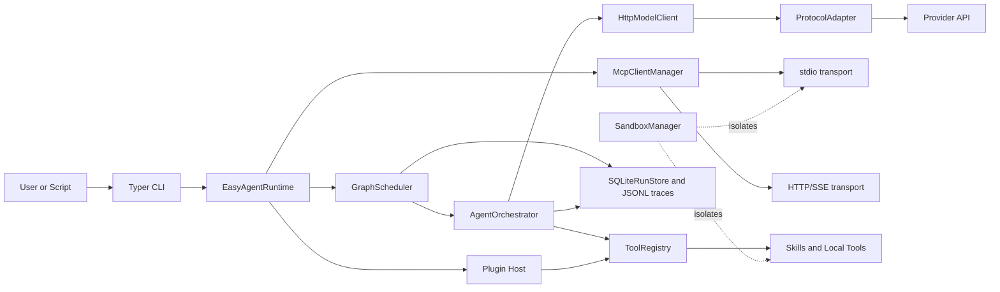
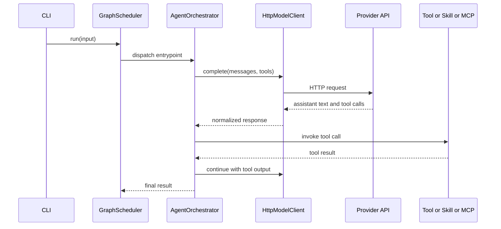

# easy-agent

[English](./README.md) | [简体中文](./README.zh-CN.md)

[](https://linux.do/)

`easy-agent` 是一个白板化、业务无关、可工程化扩展的 Python Agent 开发底座。它聚焦在运行时层，而不是某个具体业务域，因此可以把 teams、sub-agents、skills、MCP servers、plugins 以及后续协议演进挂载到同一个框架中，而不把仓库绑死在单一场景上。

## 技术栈

<table>
  <tr>
    <td valign="top" width="25%">
      <strong>运行时</strong><br>
      <br>
      <br>
      <br>
      
    </td>
    <td valign="top" width="25%">
      <strong>Agent Core</strong><br>
      <br>
      <br>
      <br>
      
    </td>
    <td valign="top" width="25%">
      <strong>集成层</strong><br>
      <br>
      <br>
      <br>
      
    </td>
    <td valign="top" width="25%">
      <strong>存储与质量</strong><br>
      <br>
      <br>
      <br>
      
    </td>
  </tr>
</table>

## 项目目标

- 保持框架白板化、透明、易扩展。
- 把 Agent 工程问题和业务逻辑解耦。
- 用一个运行时承接 direct tools、skills、MCP、plugins、teams 和 graph workflows。
- 在协议、编排模式、工具边界继续演进时，尽量减少重构成本。

## 当前架构

### 运行时拓扑

说明：Mermaid 节点全部使用英文，是为了规避中文节点在部分 Mermaid 渲染器中的解析问题。



### 通信流程



### 当前通信模型

- 模型调用统一经过 `HttpModelClient`，再由协议适配层转换为 `OpenAI`、`Anthropic` 或 `Gemini` 风格的请求载荷。
- Skills 通过 Python hook 或本地命令包装后注册为运行时工具。
- 当前代码中 MCP 远程通信实现是 `stdio` 和 `HTTP/SSE`。
- 运行结果、节点状态和轨迹数据会写入 SQLite 与 JSONL trace 文件。
- 命令型 skill 和 `stdio` MCP 可以被沙盒隔离层包裹。

## 项目结构

```text
src/
  agent_cli/           CLI entrypoints and commands
  agent_common/        shared models and tool abstractions
  agent_config/        typed config models and validation
  agent_graph/         orchestration, graph scheduling, team runtime
  agent_integrations/  skills, MCP, plugins, sandbox, storage
  agent_protocols/     protocol adapters and model client
  agent_runtime/       runtime assembly, benchmarks, long-run flows
skills/
  examples/            local demo skills
  real/                real validation skills
configs/
  longrun.example.yml  real MCP + skill validation
  teams.example.yml    Agent Teams examples
scripts/
  benchmark_modes.py   live benchmark for six execution modes
  windows/             easy-agent.ps1 / easy-agent.bat
tests/
  unit/                fast isolated unit tests
  integration/         live-service integration tests
```

## 协作模式

- `single_agent`：单 Agent 直接调用工具。
- `sub_agent`：协调者通过 `subagent__*` 工具把任务委托给子 Agent。
- `multi_agent_graph`：用 graph nodes 调度多个 Agent 并聚合结果。
- `Agent Teams`：
  - `round_robin`
  - `selector`
  - `swarm`

## Plugins、Skills 与 MCP

```python
from pathlib import Path

from agent_runtime.runtime import build_runtime

runtime = build_runtime('easy-agent.yml')
runtime.load(Path('skills/examples'))
runtime.load('third_party_plugin')
```

支持的挂载方式：

- 本地 skill 目录
- `plugin.yaml` 或 `easy-agent-plugin.yaml` 这类 plugin manifest
- `agent_runtime.plugins` 中暴露的 Python package entry point
- 在 YAML 配置中声明的 MCP server

## 快速开始

### 环境准备

```powershell
uv venv --python 3.12
uv sync --dev
```

### 本地凭据

运行时现在支持本地 `.env.local` 文件。可以把机器专属凭据放进去，避免每次手动导出环境变量。

示例键：

```dotenv
DEEPSEEK_API_KEY=your-key
PG_HOST=127.0.0.1
PG_PORT=5432
PG_USER=postgres
PG_PASSWORD=your-password
PG_DATABASE=postgres
REDIS_URL=redis://127.0.0.1:6379/0
```

### 常用命令

```powershell
uv run easy-agent doctor -c easy-agent.yml
uv run easy-agent skills list -c easy-agent.yml
uv run easy-agent plugins list -c easy-agent.yml
uv run easy-agent teams list -c configs/teams.example.yml
uv run python scripts/benchmark_modes.py --config easy-agent.yml --repeat 1
```

### Windows 快捷入口

```powershell
powershell -ExecutionPolicy Bypass -File scripts/windows/easy-agent.ps1 --help
cmd /c scripts/windows/easy-agent.bat --help
```

## 真实使用效果

当前真实基准来自 `.easy-agent/benchmark-report.json`，底座模型是通过 OpenAI-compatible 路径访问的 DeepSeek。

| 模式 | 成功率 | 平均耗时 | 平均工具调用 | 平均子 Agent 调用 |
| --- | --- | ---: | ---: | ---: |
| `single_agent` | 1/1 | 6.1493 | 1 | 0 |
| `sub_agent` | 1/1 | 20.6691 | 1 | 1 |
| `multi_agent_graph` | 1/1 | 14.4803 | 2 | 0 |
| `team_round_robin` | 1/1 | 11.2187 | 1 | 0 |
| `team_selector` | 1/1 | 15.1416 | 1 | 0 |
| `team_swarm` | 1/1 | 11.0792 | 2 | 0 |

## 参考官方 Agent 框架后可继续补强的方向

当前实现是偏务实的工程底座，但参考主流官方文档后，可以很清楚地看到下一步值得补强的点：

- 增加 session-oriented memory，让运行时不仅保存 trace，还能保存可恢复的会话状态。
- 为长流程 graph 和 team workflow 增加 resumable checkpoints。
- 在工具调用前和最终输出前增加显式 guardrail hooks。
- 增强 tracing 与 event streaming，覆盖 agent、team、tool、MCP 边界。
- 继续保持 team orchestration 的显式建模，不把 round robin、selector、swarm 全都折叠成一个模糊循环。
- 在未来版本中升级远程 MCP transport，但当前文档仍然只描述仓库已经实现的通信方式。

参考资料：

- OpenAI Agents SDK Sessions: <https://openai.github.io/openai-agents-python/sessions/>
- OpenAI Agents SDK Handoffs: <https://openai.github.io/openai-agents-python/handoffs/>
- OpenAI Agents SDK Guardrails: <https://openai.github.io/openai-agents-python/guardrails/>
- OpenAI Agents SDK Tracing: <https://openai.github.io/openai-agents-python/tracing/>
- AutoGen Teams: <https://microsoft.github.io/autogen/stable/user-guide/agentchat-user-guide/tutorial/teams.html>
- AutoGen Selector Group Chat: <https://microsoft.github.io/autogen/stable/user-guide/agentchat-user-guide/selector-group-chat.html>
- AutoGen Swarm: <https://microsoft.github.io/autogen/stable/user-guide/agentchat-user-guide/swarm.html>
- LangGraph Durable Execution: <https://docs.langchain.com/oss/python/langgraph/durable-execution>
- LangGraph Memory: <https://docs.langchain.com/oss/python/langgraph/memory>
- MCP Transports: <https://modelcontextprotocol.io/docs/concepts/transports>

## 测试

```powershell
uv run ruff check src tests scripts
uv run mypy src tests scripts
uv run python -m pytest tests/unit -q
uv run python -m pytest tests/integration/test_teams_real.py -m real -q
```

如果要执行完整 long-run live suite，本地 `.env.local` 或环境变量中还需要提供 PostgreSQL 与 Redis 的真实凭据。

## 致谢

- [Linux.do](https://linux.do/) 提供了开放的社区讨论与知识分享环境。
- DeepSeek 提供了本仓库真实验证流程使用的模型端点。

## License

MIT
