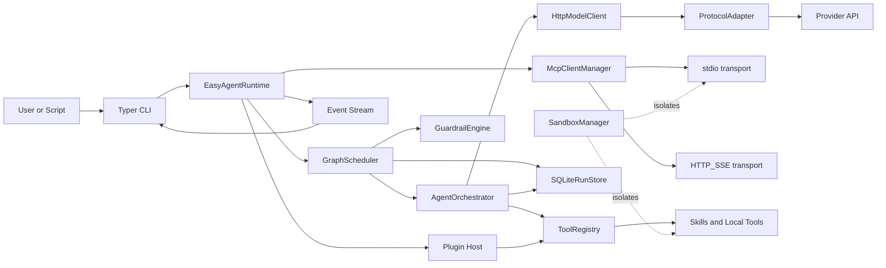
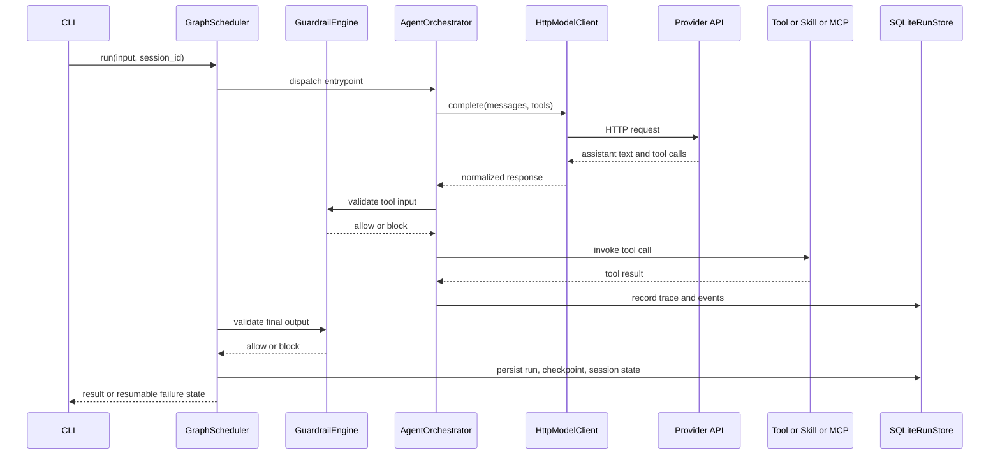

# easy-agent

[English](./README.md) | [简体中文](./README.zh-CN.md)

`easy-agent` 是一个白板化、业务无关、可工程化扩展的 Python Agent 开发底座。它聚焦在运行时工程层，而不是某个具体业务域，因此可以把 teams、sub-agents、skills、MCP servers、plugins、session memory 以及后续协议演进挂载到同一个框架中，而不把仓库绑定到单一产品场景。

## 技术栈

<table>
  <tr>
    <td valign="top" width="25%">
      <strong>运行时</strong><br>
      <br>
      <br>
      <br>
      
    </td>
    <td valign="top" width="25%">
      <strong>Agent Core</strong><br>
      <br>
      <br>
      <br>
      
    </td>
    <td valign="top" width="25%">
      <strong>集成层</strong><br>
      <br>
      <br>
      <br>
      
    </td>
    <td valign="top" width="25%">
      <strong>状态与观测</strong><br>
      <br>
      <br>
      <br>
      
    </td>
  </tr>
</table>

## 项目目标

- 保持 Agent 基础设施白板化、透明、易扩展。
- 把 Agent 工程问题和业务逻辑彻底解耦。
- 用一个运行时承接 direct tools、skills、MCP、plugins、teams、session memory 和 graph workflows。
- 在协议、工具 schema、编排模式继续演进时，尽量减少重构成本。

## Features

- 显式、白盒的运行时分层，核心由 scheduler、orchestrator、registry、storage、guardrails 和 protocol adapter 组成。
- 面向 `OpenAI`、`Anthropic`、`Gemini` 风格载荷的统一协议适配模型调用。
- 面向 Tool Calling 2.0 的运行时，支持 direct tools、command skills、Python hook skills、MCP tools 和 plugin mounting。
- 支持 `single_agent`、`sub_agent`、`multi_agent_graph` 与 `Agent Teams` 协作模式。
- 在工具执行前和最终输出前增加显式 guardrail hooks。
- 对工具参数做 schema-aware validation，并在模型输出非法参数时触发 self-repair loop。
- 支持带显式 `session_id` 的 session-oriented memory，持久化会话消息和 graph shared state。
- 为长流程 graph workflow 与顶层 team workflow 提供 resumable checkpoints。
- 提供覆盖 run、agent、team、tool、guardrail、MCP 边界的 enriched tracing 与 event streaming。
- 对 command skills 与 `stdio` MCP 提供沙盒隔离，并支持 Windows fallback 处理。
- 内置 BFCL 子集与 tau2 mock 子集的 public evaluation harness。

## 当前架构

### 运行时拓扑



### 通信流程



### 当前通信模型

- 模型调用统一经过 `HttpModelClient`，再由协议适配层转换为 `OpenAI`、`Anthropic` 或 `Gemini` 风格的请求载荷。
- Skills 通过 Python hook 或本地命令包装后注册为运行时工具。
- 当前代码中 MCP 远程通信实现是 `stdio` 和 `HTTP/SSE`。
- Guardrails 会在工具执行前和最终输出前运行。
- 运行轨迹、session messages、session state、checkpoints 与事件 envelope 会落到 SQLite 与 JSONL traces。
- CLI 的流式输出直接复用运行时事件通道，可观测 agent、team、tool、guardrail 与 MCP 状态切换。

## 状态、记忆与恢复

- 直接 agent 和顶层 team 运行可以通过 `--session-id` 复用历史对话上下文。
- Graph 运行会把 `shared_state` 绑定到同一个 `session_id`，后续运行可以继续使用持久化的图状态。
- Graph checkpoints 会在图启动时创建，并在每个节点成功后继续落盘。
- 顶层 team checkpoints 会在 team 启动时创建，并在每次完整 turn 结束后继续落盘。
- `easy-agent resume <run_id>` 会从最近一次 checkpoint 恢复可恢复的 graph 与顶层 team 运行。

## 项目结构

```text
src/
  agent_cli/           CLI entrypoints and commands
  agent_common/        shared models and tool abstractions
  agent_config/        typed config models and validation
  agent_graph/         orchestration, graph scheduling, team runtime
  agent_integrations/  skills, MCP, plugins, sandbox, storage, guardrails
  agent_protocols/     protocol adapters and model client
  agent_runtime/       runtime assembly, benchmarks, long-run flows, public eval
skills/
  examples/            本地演示 skills
  real/                真实验证 skills
configs/
  longrun.example.yml  真实 MCP + skill 验证
  teams.example.yml    Agent Teams 示例
public_evals/
  fixtures/            vendored BFCL 与 tau2 公共子集
scripts/
  benchmark_modes.py   六种执行模式的 live benchmark
  windows/             easy-agent.ps1 / easy-agent.bat
tests/
  unit/                快速隔离单元测试
  integration/         真实服务集成测试
```

## 协作模式

- `single_agent`：单 Agent 直接调用工具。
- `sub_agent`：协调者通过 `subagent__*` 工具把任务委托给子 Agent。
- `multi_agent_graph`：用 graph nodes 调度多个 Agent 并聚合结果。
- `Agent Teams`：
  - `round_robin`
  - `selector`
  - `swarm`

## Plugins、Skills 与 MCP

```python
from pathlib import Path

from agent_runtime.runtime import build_runtime

runtime = build_runtime('easy-agent.yml')
runtime.load(Path('skills/examples'))
runtime.load('third_party_plugin')
```

支持的挂载方式：

- 本地 skill 目录
- `plugin.yaml` 或 `easy-agent-plugin.yaml` 这类 plugin manifest
- `agent_runtime.plugins` 中暴露的 Python package entry point
- 在 YAML 配置中声明的 MCP server

## 快速开始

### 环境准备

```powershell
uv venv --python 3.12
uv sync --dev
```

### 本地凭据

运行时支持本地 `.env.local` 文件。可以把机器专属凭据放进去，避免每次手动导出环境变量。

示例键：

```dotenv
DEEPSEEK_API_KEY=your-key
PG_HOST=127.0.0.1
PG_PORT=5432
PG_USER=postgres
PG_PASSWORD=your-password
PG_DATABASE=postgres
REDIS_URL=redis://127.0.0.1:6379/0
```

### 常用命令

```powershell
uv run easy-agent doctor -c easy-agent.yml
uv run easy-agent skills list -c easy-agent.yml
uv run easy-agent plugins list -c easy-agent.yml
uv run easy-agent teams list -c configs/teams.example.yml
uv run easy-agent run "summarize the repository" --session-id demo-session -c easy-agent.yml
uv run easy-agent resume <run_id> -c configs/teams.example.yml
uv run python scripts/benchmark_modes.py --config easy-agent.yml --repeat 1
uv run easy-agent integration public-eval -c easy-agent.yml --output .easy-agent/public-eval-report.json
uv run easy-agent integration longrun -c configs/longrun.example.yml --cycles 1 --output-root .easy-agent/longrun
```

### Windows 快捷入口

```powershell
powershell -ExecutionPolicy Bypass -File scripts/windows/easy-agent.ps1 --help
cmd /c scripts/windows/easy-agent.bat --help
```

## 真实使用效果

### Live Benchmark 快照

最新本地 benchmark 快照来自 2026-03-26 的 `.easy-agent/benchmark-report.json`，底座模型是通过 OpenAI-compatible 路径访问的 DeepSeek。

| 模式 | 成功率 | 平均耗时 | 平均工具调用 | 平均子 Agent 调用 |
| --- | --- | ---: | ---: | ---: |
| `single_agent` | 1/1 | 4.9189 | 1 | 0 |
| `sub_agent` | 1/1 | 15.9533 | 1 | 1 |
| `multi_agent_graph` | 1/1 | 13.4902 | 2 | 0 |
| `team_round_robin` | 1/1 | 7.7634 | 1 | 0 |
| `team_selector` | 1/1 | 26.4179 | 1 | 0 |
| `team_swarm` | 1/1 | 10.5093 | 2 | 0 |

### Public Eval 快照

最新本地 public eval 快照来自 2026-03-26 的 `.easy-agent/public-eval-report.json`。

| 套件 | 成功数 | 通过率 | Tool Match | Arg Match | 平均耗时 |
| --- | --- | ---: | ---: | ---: | ---: |
| `bfcl_simple` | 6/8 | 0.7500 | 0.7500 | 0.7500 | 10.6425 |
| `bfcl_multiple` | 2/8 | 0.2500 | 0.2500 | 0.2500 | 4.5149 |
| `bfcl_parallel_multiple` | 0/4 | 0.0000 | 0.0000 | 0.0000 | 13.7242 |
| `bfcl_irrelevance` | 0/4 | 0.0000 | 0.0000 | 0.0000 | 2.3965 |
| `tau2_mock` | 3/3 | 1.0000 | 1.0000 | 1.0000 | 5.9955 |
| `overall_bfcl` | 8/24 | 0.3333 | 0.3333 | 0.3333 | - |

这次 DeepSeek 基线里观察到的情况：

- tau2 mock 子集在补上 session-history prompt fallback 后已经稳定全通过。
- BFCL 子集在补上 tool schema 规范化和函数名清洗后，已经从“请求级失败”变成了可解释的真实结果。
- 剩余 BFCL 失败主要集中在 multi-tool 和 irrelevance 场景。以 2026-03-26 这次运行为例，其中一部分 case 仍然会触发 `https://api.deepseek.com/chat/completions` 的 provider-side `400 Bad Request`，因此当前 BFCL 更适合作为兼容性基线，而不是最终排行榜分数。

## 设计参考

当前运行时借鉴了多个生产级 Agent 系统中的显式设计思路，但仍然保持本仓库自己的白盒实现。

- OpenAI Agents SDK Sessions: <https://openai.github.io/openai-agents-python/sessions/>
- OpenAI Agents SDK Handoffs: <https://openai.github.io/openai-agents-python/handoffs/>
- OpenAI Agents SDK Guardrails: <https://openai.github.io/openai-agents-python/guardrails/>
- OpenAI Agents SDK Tracing: <https://openai.github.io/openai-agents-python/tracing/>
- AutoGen Teams: <https://microsoft.github.io/autogen/stable/user-guide/agentchat-user-guide/tutorial/teams.html>
- AutoGen Selector Group Chat: <https://microsoft.github.io/autogen/stable/user-guide/agentchat-user-guide/selector-group-chat.html>
- AutoGen Swarm: <https://microsoft.github.io/autogen/stable/user-guide/agentchat-user-guide/swarm.html>
- LangGraph Durable Execution: <https://docs.langchain.com/oss/python/langgraph/durable-execution>
- LangGraph Memory: <https://docs.langchain.com/oss/python/langgraph/memory>
- MCP Transports: <https://modelcontextprotocol.io/docs/concepts/transports>

## 测试

```powershell
uv run ruff check src tests scripts
uv run mypy src tests scripts
uv run python -m pytest tests/unit -q
uv run python -m pytest tests/integration -m real -q
uv run easy-agent --help
uv run easy-agent doctor -c easy-agent.yml
uv run easy-agent teams list -c configs/teams.example.yml
```

如果要执行完整 live suite，本地 `.env.local` 或环境变量中还需要提供 PostgreSQL 与 Redis 的真实凭据。

## 致谢

- [Linux.do](https://linux.do/) 提供了开放的社区讨论与知识分享环境。
- [](https://www.deepseek.com/) 为本仓库真实验证流程提供了模型端点基线。

## License

MIT
